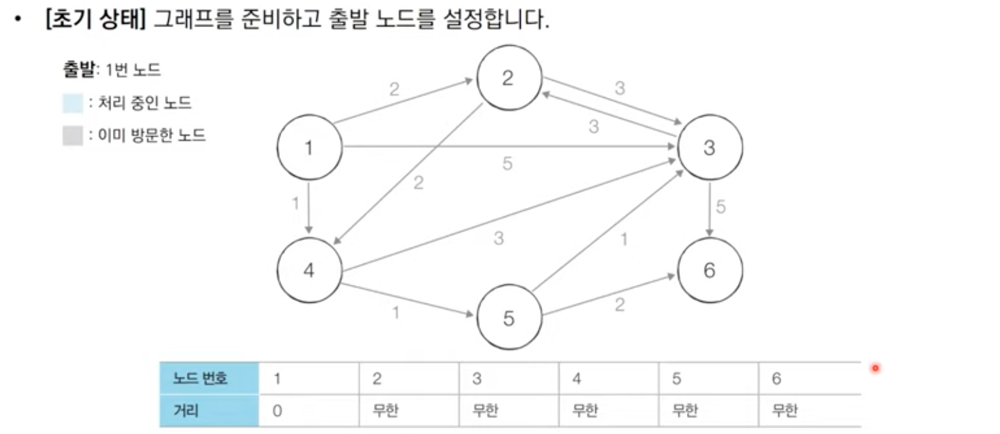

# 가장 빠른 길 찾기
-  가장 빠르게 도달하는 방법
## 1. 최단경로 알고리즘(Shortest Path)
- 가장 짧은 경로를 찾는 알고리즘. '길 찾기' 문제라고도 불림.
- 상황에 맞는 효율적인 알고리즘이 이미 정립되어있음
- '한 지점에서 다른 특정 지정까지의 최단 경로를 구해야 하는 경우'
- '모든 지점에서 다른 모든 지점까지의 최단 경로를 모두 구해야 하는 경우'
- 보통 그래프를 사용해서 표현. '노드'와 '간선'으로 표현함.
- 코테에서는 최단경로를 모두 출력하는 문제보다는, 단순히 최단거리를 출력하도록 요구하는 문제가 많이 출제.
- 다익스트라(Dijkstra) 최단 경로 알고리즘, 플로이드 워셜, 벨만 포드 알고리즘.
---
## 2. 다익스트라(Dijkstra) 최단 경로 알고리즘
- 그래프에 여러 개의 노드가 있을 때, 특정 노드에서 출발하여 다른 노드로 가는 각각의 최단 경로를 구해주는 알고리즘.
- '음의 간선'이 없을 때 정상적으로 동작함.
- 기본적으로 그리디 알고리즘임
- 실제 GPS 소프트웨어의 기본 알고리즘으로 채택
---
### 다익스트라 알고리즘
- '각 노드에 대한 현재까지의 최단 거리' 정보를 항상 1차원 리스트에 저장하며 리스트를 계속 갱신한다는 특징. (1차원 최단 거리 테이블 이용)
- 한 단계장 하나의 노드에 대한 최단거리를 확실하게 찾는 것으로 이해할 수 있다.
1. 출발 노드를 설정
2. 최단 거리 테이블을 초기화
3. 방문하지 않은 노드 중에서 최단거리가 가장 짧은 노드를 선택
4. 해당 노드를 거쳐 다른 노드로 가는 비용을 계산하여 최단거리 테이블을 갱신
5. 3 - 4를 반복


step0. 최단 거리 테이블을 무한대로 초기화, 출발 노드를 선택 (1번 노드)   
step1. 1번 노드를 거쳐 다른 노드로 가는 비용 계산. 최소 비용을 갱신   
step2. 이후의 모든 단계에서 마찬가지로 방문하지 않은 노드 중에서 최단거리가 가장 짧은 노드를 선택. 1 -> 4번 노드를 거쳐 갈 수 있는 노드들을 확인. 이후 최단거리 갱신.   
step3. 최단 테이블에서 마찬가지로 가장 최소 비용 선택(노드 2). 최소 비용이 같다면, 일반적으로 번호가 작은 노드 선택함. 최단 거리 테이블 갱신. 그러나 이번 회치에선 갱신할 내용이 없으므로 패스.   
step4. 동일한 과정들을 반복.    
step5. 모든 노드를 다 확인 후, 최단 거리 테이블에서 도착 노드의 최단거리를 확인한다 

---
### 구현
1. 구현하기 쉽지만 느리게 동작하는 코드
2. 구현하기에 조금 더 까다롭지만 빠르게 동작하는 코드 <- 정확히 이해하고 구현하는것을 목표로 할 것!
---
### 1. 간단한 다익스트라 알고리즘
- O(V^2)의 시간 복잡도. V: 노드의 개수
- 직관적이고 쉽게 이해할 수 있다.
- 단계마다 '방문하지 않은 노드 중에서, 최단거리가 가장 짧은 노드를 선택' 하기 위해서 매 단계마다 1차원 리스트의 모든 원소를 확인(순차 탐색)
- 최단 경로를 모드 출력하는 내용은 패스
- 노드가 10,000개 이상 넘어가게 되면 시간초과  
``` C++
#include <iostream>
#include <vector>
#define INF 1e9 // 무한을 의미하는 값으로 10억을 설정

using namespace std;

// 노드의 개수(N), 간선의 개수(M), 시작 노드 번호(Start)
// 노드의 개수는 최대 100,000개라고 가정
int n, m, start;
// 각 노드에 연결되어 있는 노드에 대한 정보를 담는 배열
vector<pair<int, int> > graph[100001];
// 방문한 적이 있는지 체크하는 목적의 배열 만들기
bool visited[100001];
// 최단 거리 테이블 만들기
int d[100001];

// 방문하지 않은 노드 중에서, 가장 최단 거리가 짧은 노드의 번호를 반환
int getSmallestNode() {
    int min_value = INF;
    int index = 0; // 가장 최단 거리가 짧은 노드(인덱스)
    for (int i = 1; i <= n; i++) {
        if (d[i] < min_value && !visited[i]) {
            min_value = d[i];
            index = i;
        }
    }
    return index;
}

void dijkstra(int start) {
    // 시작 노드에 대해서 초기화
    d[start] = 0;
    visited[start] = true;
    for (int j = 0; j < graph[start].size(); j++) {
        d[graph[start][j].first] = graph[start][j].second;
    }
    // 시작 노드를 제외한 전체 n - 1개의 노드에 대해 반복
    for (int i = 0; i < n - 1; i++) {
        // 현재 최단 거리가 가장 짧은 노드를 꺼내서, 방문 처리
        int now = getSmallestNode();
        visited[now] = true;
        // 현재 노드와 연결된 다른 노드를 확인
        for (int j = 0; j < graph[now].size(); j++) {
            int cost = d[now] + graph[now][j].second;
            // 현재 노드를 거쳐서 다른 노드로 이동하는 거리가 더 짧은 경우
            if (cost < d[graph[now][j].first]) {
                d[graph[now][j].first] = cost;
            }
        }
    }
}

int main(void) {
    cin >> n >> m >> start;

    // 모든 간선 정보를 입력받기
    for (int i = 0; i < m; i++) {
        int a, b, c;
        cin >> a >> b >> c;
        // a번 노드에서 b번 노드로 가는 비용이 c라는 의미
        graph[a].push_back({ b, c });
    }

    // 최단 거리 테이블을 모두 무한으로 초기화
    fill_n(d, 100001, INF);

    // 다익스트라 알고리즘을 수행
    dijkstra(start);

    // 모든 노드로 가기 위한 최단 거리를 출력
    for (int i = 1; i <= n; i++) {
        // 도달할 수 없는 경우, 무한(INFINITY)이라고 출력
        if (d[i] == INF) {
            cout << "INFINITY" << '\n';
        }
        // 도달할 수 있는 경우 거리를 출력
        else {
            cout << d[i] << '\n';
        }
    }
}
```
### 2. 개선된 다익스트라 알고리즘
- 최악의 경우에도 시간복잡도 O(ElogV). E : 간선의 개수
- 간단한 다익스트라 알고리즘은 최단거리가 가장 짧은 노드를 찾기 위해서, 매번 최단거리 테이블을 선형적으로 탐색해야했음. 이를 선형적이 아니라, 더 빠르게 찾으면 개선됨.
- 우선순위 큐를 이용하여 사용하는 자료구조중 하나인 Heap 자료 구조 이용.
- 대부분의 알고리즘 라이브러리들이 지원하므로, 직접 구현하진 않을거임.
- Tip 최소힙을 최대힙처럼 사용하는 방법 : 음수 부호를 붙인다!
- 현재 가장 가까운 노드를 저장하기 위한 목적으로만 우선순위 큐를 추가로 이용
- 우선순위 큐에서 노드를 꺼낸 뒤, 해당 노드를 이미 처리한적이 있다면 무시. 아직 처리하지 않았다면 처리한다.

``` C++

#include <bits/stdc++.h>
#define INF 1e9 // 무한을 의미하는 값으로 10억을 설정

using namespace std;

// 노드의 개수(N), 간선의 개수(M), 시작 노드 번호(Start)
// 노드의 개수는 최대 100,000개라고 가정
int n, m, start;
// 각 노드에 연결되어 있는 노드에 대한 정보를 담는 배열
vector<pair<int, int> > graph[100001];
// 최단 거리 테이블 만들기
int d[100001];

void dijkstra(int start) {
    priority_queue<pair<int, int> > pq;
    // 시작 노드로 가기 위한 최단 경로는 0으로 설정하여, 큐에 삽입
    pq.push({0, start});
    d[start] = 0;
    while (!pq.empty()) { // 큐가 비어있지 않다면
        // 가장 최단 거리가 짧은 노드에 대한 정보 꺼내기
        int dist = -pq.top().first; // 현재 노드까지의 비용 
        int now = pq.top().second; // 현재 노드
        pq.pop();
        // 현재 노드가 이미 처리된 적이 있는 노드라면 무시
        if (d[now] < dist) continue;
        // 현재 노드와 연결된 다른 인접한 노드들을 확인
        for (int i = 0; i < graph[now].size(); i++) {
            int cost = dist + graph[now][i].second;
            // 현재 노드를 거쳐서, 다른 노드로 이동하는 거리가 더 짧은 경우
            if (cost < d[graph[now][i].first]) {
                d[graph[now][i].first] = cost;
                pq.push(make_pair(-cost, graph[now][i].first));
            }
        }
    }
}

int main(void) {
    cin >> n >> m >> start;

    // 모든 간선 정보를 입력받기
    for (int i = 0; i < m; i++) {
        int a, b, c;
        cin >> a >> b >> c;
        // a번 노드에서 b번 노드로 가는 비용이 c라는 의미
        graph[a].push_back({b, c});
    }

    // 최단 거리 테이블을 모두 무한으로 초기화
    fill(d, d + 100001, INF);
    
    // 다익스트라 알고리즘을 수행
    dijkstra(start);

    // 모든 노드로 가기 위한 최단 거리를 출력
    for (int i = 1; i <= n; i++) {
        // 도달할 수 없는 경우, 무한(INFINITY)이라고 출력
        if (d[i] == INF) {
            cout << "INFINITY" << '\n';
        }
        // 도달할 수 있는 경우 거리를 출력
        else {
            cout << d[i] << '\n';
        }
    }
}

```